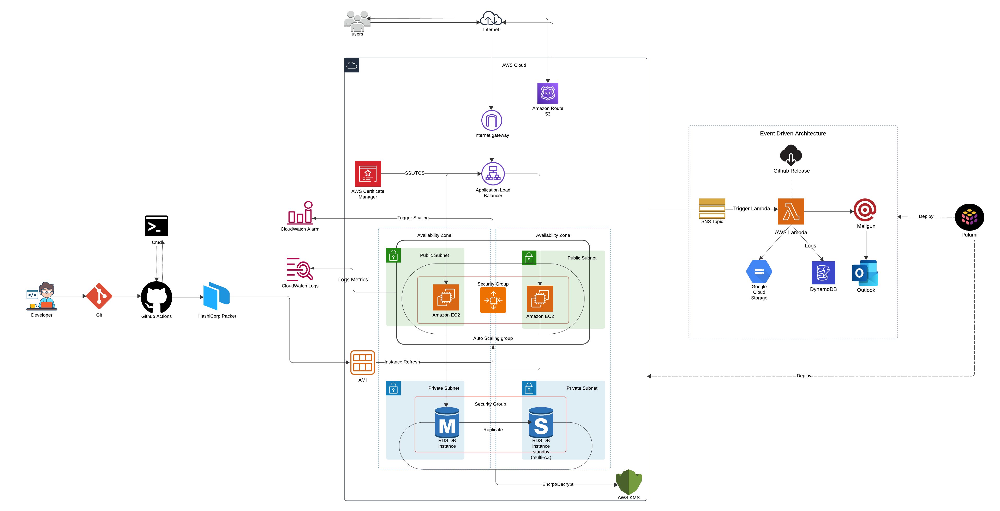

<a name="readme-top"></a>

## Project Title: Cloud-Native Web Application on AWS/GCP with Event-Driven Architecture

## Description
Developed RESTful API with (Python) Flask and deployed on an AWS EC2 instance, providing robust backend services with PostgreSQL database hosted on Amazon RDS. Emphasizing security, the API integrates Basic Authentication and utilizes SQLAlchemy as an ORM framework to interact seamlessly with the database. The project leverages Pulumi for infrastructure provisioning, integrates AWS services for event-driven operations, and employs GitHub Actions for CI/CD.

## Architecture Overview
Below is a detailed Architecture Diagram illustrating the comprehensive setup and flow of the project:

<p align="center">

</p>

## Technical Stack & Features

**Python 3.11 & Flask**: Utilizes Object-Oriented Principles (OOP) for a scalable codebase and (web framework) Flask for efficient API development.

**SQLAlchemy & PostgreSQL**: ORM Framework for seamless database operations with PostgreSQL hosted on Amazon RDS, ensuring robust data management.

**Pulumi**: Infrastructure as Code (IaC) for consistent cloud infrastructure provisioning on AWS and GCP.

**Environment Setup**: The project is set up across two AWS Organizations to segregate `development` and `production` environments, enhancing security and operational efficiency.

**Load Balancing & Auto-Scaling**: This project harnesses AWS Elastic Load Balancing and Auto Scaling to optimize the handling of incoming traffic and resource utilization. 

**AWS Lambda**: Utilized for creating an event-driven solution that responds to application events with automated processes.

**GitHub Actions**: Facilitates CI/CD pipelines for automated testing, building, and deployment.

**Bash Scripting**: Enables automation of deployment processes and environment setup.

**Postman**: Supports API testing to ensure endpoint functionality, reliability, and security.

**Systemd**: Facilitates automatic application startup and management, ensuring reliability.

**Hashicorp Packer**: Used for creating custom AMIs, streamlining deployment with pre-configured environments.

**CloudWatch**: Provides logging and monitoring, enabling efficient debugging and performance tracking.

**Custom Metrics with StatsD**: Custom metrics have been implemented using StatsD to monitor and `count the number of calls to each API endpoint`, facilitating in-depth analysis and optimization of web application usage. 

## Setup and Installation

**Step 1** : Clone the Repository
```bash
git clone git@github.com:DeepakSawalka/Web_Application_API.git
```
**Step 2** : Create Virtual Environment inside Web_Application_API folder
```bash
python3 -m venv .venv
```
**Step 3** : Activate Virtual Environment in Bash/zsh Shell
```bash
source ./venv/bin/activate
```
**Step 4** : Install dependencies from requirements.txt file
```bash
pip install -r requirements.txt
```
**Step 5** : Create a `.env` file in your folder
```bash
DBHOST="localhost"
DBPORT=port
DBUSER="username"
DBPASS="password"
DATABASE="database_name"
PORT=application_port
CSV_PATH="csv_file_path"
```
## API Endpoints Overview

This project provides a robust set of RESTful API endpoints catering to various application functionalities. Below is an overview of the available endpoints with their respective HTTP methods.

| HTTP Method | Endpoint                            | Description                                 |
|-------------|-------------------------------------|---------------------------------------------|
| GET         | `/healthz`                          | Health Check API - Checks if the application has connectivity to the database. |
| POST        | `/v1/assignments`                   | Create a new assignment. |
| GET         | `/v1/assignments`                   | Retrieve list of all assignments. |
| GET         | `/v1/assignments/{id}`              | Retrieve Details about specific assignment. |
| PUT         | `/v1/assignments/{id}`              | Update assignment.                       |
| DELETE      | `/v1/assignments/{id}`              | Delete assignment.     |
| POST        | `/v1/assignments/{id}/submission`   | Submit assignment.     |

<p align="right">(<a href="#readme-top">Back to Top</a>)</p>

## Checkout my other 2 Repositories 

1. **Infrastructure as Code with Pulumi** - [](https://github.com/yourusername/companion-toolkit)

2. **Serverless - Event Driven Architecture** - [](https://github.com/yourusername/companion-toolkit)

### Domain Registration

- **Registrar**: Namecheap
- **Domain**: `deepakcsye6225.me`

### Email Configuration

- Utilizes the `Mailgun API` for reliable email delivery and management.

## Security Measures

To ensure the security integrity of the application, several measures have been adopted:

1. **Application Ownership**: Both the application directory and binary are not owned by the admin user & group to minimize risks.
2. **Dedicated User**: A non-privileged, dedicated user account is created for application execution, preventing unauthorized access or execution.
3. **SystemD Integration**: The application is launched using a SystemD unit file configured to run under the dedicated `non-privileged user`, further securing the application runtime environment.

### SSL Certificates

- **Development Environment**: SSL certificates are obtained through AWS Certificate Manager, ensuring secure communications.
- **Demo Environment**: SSL certificates are procured from Zero SSL, providing validated security for external communications.

- To import an SSL certificate into AWS Certificate Manager, use the following command:
```bash
Get-Content -Path "certificate.crt" | Set-Clipboard
Get-Content -Path "ca_bundle.crt" | Set-Clipboard
Get-Content -Path "private.key" | Set-Clipboard
```

### Load Balancer Configuration

- Ensures the use of valid SSL certificates to secure all data in transit and provide trust to end-users accessing the application.

<p align="right">(<a href="#readme-top">Back to Top</a>)</p>
